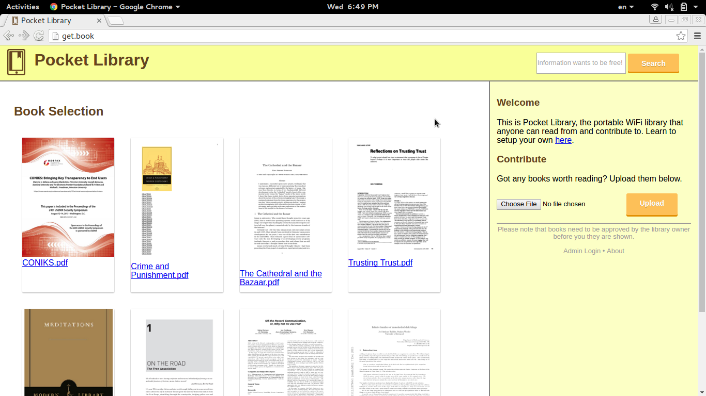

Pocket Library
==============
Share books from anywhere! Pocket Library is a lightweight portable library designed to run on
OpenWrt devices. **Still in development. Don't actually run this!**

Features:

 * **Share books with ease** - Pocket Library allows anyone in WiFi range to download books
 * **Find books quickly** - Search allows you locate uploaded books quickly
 * **Contribute your favorite books** - Users can upload their own books to the library for sharing
 * **Take your books with you** - Install on a portable router for sharing books on the road
 * **Be in control** - Choose whether books uploaded to the library need to be approved
 * **Easy insallation** - Simply flash the Pocket Library image and plug in a USB drive
 * **Wide compatability** - Works with any router that supports OpenWRT

## Installation
There are two methods for installation. The first method is the easiest, but is only compatible
with the following devices:

* [TP-Link MR3020](https://wiki.openwrt.org/toh/tp-link/tl-mr3020)
* [TP-Link MR3420](http://www.amazon.com/TP-LINK-TL-MR3420-3G-Wireless-Router/dp/B003WK62OS)
* More devices to be added soon

If your device is one of these, follow [this visual guide]() to get Pocket Library quickly 
up and running.

### Generating Pokcet Library Images
Device not on the list? No worries. Please note that this method requires basic familiarity with
OpenWRT (or any custom router frimware) and the linux command line. Only compatible with `x86_64` systems.

If you are following this method, I'll gladly help with troubleshooting so that we can add
your device to the *confirmed working* list above. Details to contact me [here](https://darkdepths.net/pages/contact-keys.html).

First, use [this page](https://wiki.openwrt.org/toh/start) to find the OpenWRT codename for your device. 
For example, to find the code name for the TP-Link MR3020, type `MR3020` into the model search
field.

XXX explain how to find TARGET and ARCH.

Open the command line and clone this repository:

    git clone --depth 1 https://github.com/0xPoly/pocket-library.git

Install make's dependencies:

    sudo apt-get install subversion build-essential libncurses5-dev zlib1g-dev gawk git ccache gettext libssl-dev xsltproc

Next, download and build the image:

    make all ARCH=ar71xx TARGET=TLMR3420

If all goes well, you should have an image located in `build/openwrt/OpenWrt-ImageBuilder-*/bin/`.
The image that you need to install to the router ends with `*-factory.bin`.

Beforing powering up the device, we will need to unzip the contents of
`usb.zip` onto a USB flash drive. Make sure the flash drive has one FAT
partition. All the books will be stored on the flash drive.

Insert the flash drive into your router, install the generated image. If
all goes well, after some amount of time the router will reboot and Pocket
Library will be up and running.

